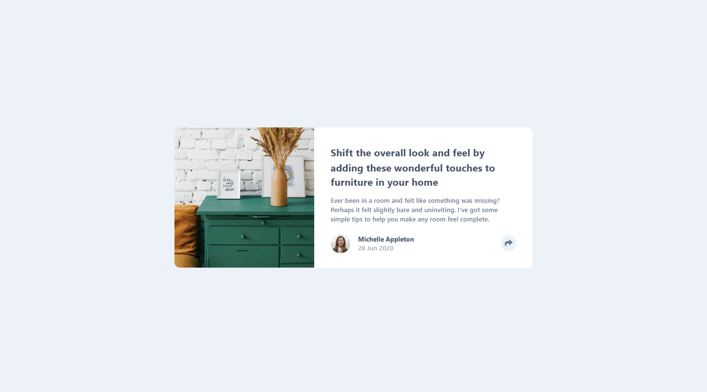
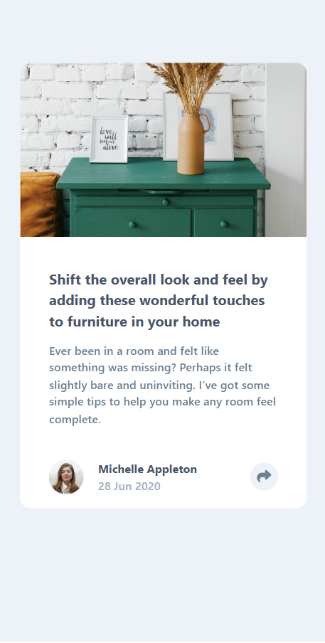

# Frontend Mentor - Article preview component solution

This is a solution to the [Article preview component challenge on Frontend Mentor](https://www.frontendmentor.io/challenges/article-preview-component-dYBN_pYFT). Frontend Mentor challenges help you improve your coding skills by building realistic projects.

## Table of contents

- [Overview](#overview)
  - [The challenge](#the-challenge)
  - [Screenshot](#screenshot)
  - [Links](#links)
- [My process](#my-process)
  - [Built with](#built-with)
  - [What I learned](#what-i-learned)
  - [Useful resources](#useful-resources)
- [Author](#author)

## Overview

### The challenge

Users should be able to:

- View the optimal layout for the component depending on their device's screen size
- See the social media share links when they click the share icon

### Screenshot

### Links

- Solution URL: 
- Live Site URL: [https://fadymas.github.io/article-preview-component-master/](https://fadymas.github.io/article-preview-component-master/)

## My process

### Built with

- Semantic HTML5 markup
- CSS custom properties
- Flexbox
- CSS Grid
- Mobile-first workflow
- [Tailwind](https://tailwindcss.com/) - Css library

### What I learned

I learned how to use the CSS Grid system effectively to build responsive layouts that adapt to different screen sizes, and how to design and develop components that appear when clicked using JavaScript.

### Useful resources

- [Tailwind CSS Documentation](https://tailwindcss.com/docs) – Helped me understand how to use responsive utility classes and how to apply spacing, typography, and custom colors effectively.

## Author

- Frontend Mentor - [@fadymas](https://www.frontendmentor.io/profile/fadymas)

- LinkedIn - [@fady-mahros](www.linkedin.com/in/fady-mahrous)
